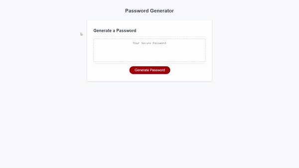

# 03-BC-Password-Challenge
This repo was created for a Password generator webpage made with JavaScript, with style being defined by a CSS file and the webpage structure by a html file.

## Description

This web application is a password generator that responds to user selections via window promts, and generates a random password according to those selections.

## Mockup

The site should have the functionality described in the following GIF image.

## Link

Follow this URL to access the website: https://alextrejo92.github.io/03-BC-Password-Challenge/

## Installation

N/A

## Credits

The web page design was provided by EdX bootcamps & Tec de Monterrey. The functionality of the page was coded by me.

## License

Standar MIT license.
